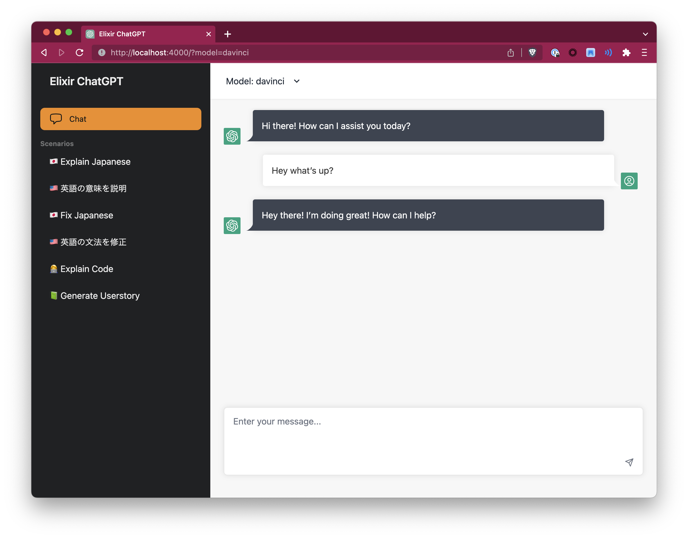
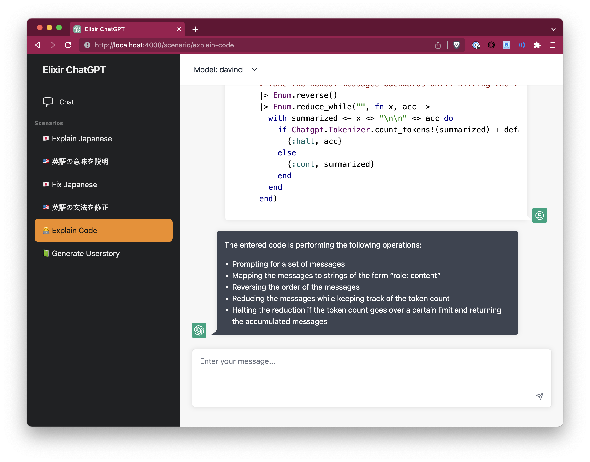

# ChatGPT UI

ChatGPT (or Claude / Gemini Pro) to host yourself, targeted at business-ey usecases that may be useful within a company, written in Elixir + LiveView



## What is this?

The goal is to create a simple ChatGPT UI, for you and your company to self-host.

## Features

- Support for OpenAI GPT4, Google Gemini (through Vertex) and Anthropic Claude models (through bedrock)
- "Scenarios" for repetitive tasks you find yourself doing a lot
- Use your own OpenAI API key
- Google OAuth authentication
- Restrict access to certain email domains
- Set which model to use
- Code highlighting with [highlightjs](https://highlightjs.org/)
- Streaming messages support
- Dark Mode
- Automatic content truncating based on token count with [bert-base-multilingual-uncased](https://huggingface.co/bert-base-multilingual-uncased)

## Configuration

In config.exs, you can set the following keys:

```elixir
config :chatgpt,
  title: "Elixir ChatGPT",
  enable_google_oauth: true,
  restrict_email_domains: false,
  allowed_email_domains: ["google.com"]

  default_model: :"gpt-4",
  models: [
    %{
      id: :"anthropic.claude-3-sonnet-20240229-v1:0",
      provider: :anthropic,  # <- provider can only be :anthropic, :google or :openai currently
      truncate_tokens: 100_000,
      name: "Claude 3 Sonnet"
    },
    # %{
    #   id: :"gemini-1.0-pro",
    #   provider: :google,
    #   truncate_tokens: 100_000,
    #   name: "Gemini Pro (Google)"
    # },
    %{
      id: :"gpt-4",
      provider: :openai,
      truncate_tokens: 8000,
      name: "GPT4"
    },
    %{
      id: :"gpt-3.5-turbo-16k",
      provider: :openai,
      truncate_tokens: 15000,
      name: "GPT3.5 Turbo 16k"
    },
    %{
      id: :"gpt-4-32k",
      provider: :openai,
      truncate_tokens: 30000,
      name: "GPT4 32k (EXPENSIVE!)"
    }
  ],
```

Then in `runtime.exs`:

```elixir

# generate them at https://platform.openai.com/account/api-keys
config :ex_openai,
  api_key: System.get_env("OPENAI_API_KEY"),
  organization_key: System.get_env("OPENAI_ORGANIZATION_KEY"),
  http_options: [recv_timeout: 50_000]

# If you set `enable_google_oauth`, also set the following keys: (by default, uses the environment variables)
# check https://github.com/dwyl/elixir-auth-google/blob/main/create-google-app-guide.md on how to get these keys

config :elixir_auth_google,
  client_id: System.get_env("GOOGLE_AUTH_CLIENT_ID"),
  client_secret: System.get_env("GOOGLE_AUTH_CLIENT_SECRET")

# if you want to use AWS Bedrock for Anthropic models
config :chatgpt,
  access_key_id: System.get_env("AWS_ACCESS_KEY_ID"),
  secret_access_key: System.get_env("AWS_SECRET_ACCESS_KEY"),
  region: System.get_env("AWS_REGION")
```

To enable google vertex, set the `GOOGLE_APPLICATION_CREDENTIALS_JSON` env variable with the content of your service account credentials. You can also set `GOOGLE_APPLICATION_CREDENTIALS` to the filepath of your service account json file, or use service account based auth when using GKE/GAE.

```
export GOOGLE_APPLICATION_CREDENTIALS_JSON='{xxxxx}'
```

### On Claude support

To enable Anthropic Claude models, you need to go to AWS Bedrock and request model access for the Claude models.

Then generate a new access key pair to use for authentication

### On Gemini Pro support

To enable Google's Gemini models, you need to enable the Vertex APIs in the google cloud console.

If you need to generate a service account credentials json, go into IAM settings, create a new service account, then generate a new key. Important here is that you provide the service account with Vertex permissions.


## Scenarios



This UI decided to go with "scenarios" instead of the usual "recent conversations" approach of the official ChatGPT.

"Scenarios" are preconfigured tasks that the AI should do, ready to be bookmarked and used whenever the task needs to be done. These can be things like:

- Rewriting JIRA tickets
- Grading user stories
- Explaining code
- Rephrasing based on corporate language

Currently, scenarios are set in `scenario.ex` and follow the `%ChatgptWeb.Scenario` struct:

```elixir
      %{
        id: "generate-userstory",
        name: "📗 Generate Userstory",
        description:
          "Give me the content of a ticket, and I will try to write a user story for you!",
        force_model: :"anthropic.claude-3-sonnet-20240229-v1:0", # optional, if you want a specific scenario to always go through a specific model. Model has to be in `models` config
        messages: [
          %ChatgptWeb.Message{
            content:
              "You are an assistant that generates user stories for tickets. First, take the inputted text and give a summary if the entered text is a good userstory or not, with explanation why.\nThen, generate a proper user-story with the inputted text in the format of 'As a X, I want to Y, so that I can Z'.",
            sender: :system
          }
        ],
        keep_context: false
      }
```

- messages are instructions to send to the LLM when the scenario is loaded, typically instructing the AI what it should do. Use `:system` messages to provide admin commands. The 3.5-turbo model is not paying so much attention to system messages, so experiment with using `:user` instead.
- `keep_context` specifies whether the conversation context should be kept. If this is set to false (recommended), each message that is sent to the AI will be treated as a new conversation, the AI will have no context on previously sent messages.

## Usage

Quick development setup:

First, install Elixir 1.14 or higher (1.13 or lower will not work).  Then:

```bash
# Clone the project
git clone https://github.com/dvcrn/chatgpt-ui
cd chatgpt-ui

# Install Elixir
mix deps.get

# Install node dependencies
yarn install      # or npm install
mix assets.setup
mix assets.build

# Start the dev server
export OPENAI_API_KEY=<api-key>
export OPENAI_ORGANIZATION_KEY=<org-key>
mix phx.server
```

## Usage / Deploying with Docker

First of all, generate a new random keybase: `mix phx.gen.secret`. A default is set, but you should _really_ change this before deploying.

```
docker build . -t chatgpt
docker run -e SECRET_KEY_BASE=<keybase here> -e HOST="localhost" -p 4000:4000 chatgpt
```

The container (by default) expects the following env vars (unless you changed it in `runtime.exs`):

- HOST
- PORT (default 4000)
- SECRET_KEY_BASE
- OPENAI_API_KEY
- OPENAI_ORGANIZATION_KEY

And if you use google oauth:

- GOOGLE_AUTH_CLIENT_ID
- GOOGLE_AUTH_CLIENT_SECRET

And if you use Anthropic through Bedrock
- AWS_ACCESS_KEY_ID
- AWS_REGION
- AWS_SECRET_ACCESS_KEY

And if you use Google Vertex

- GOOGLE_CLOUD_PROJECT_ID
- GOOGLE_APPLICATION_CREDENTIALS_JSON

## Status

Super work-in-progress
