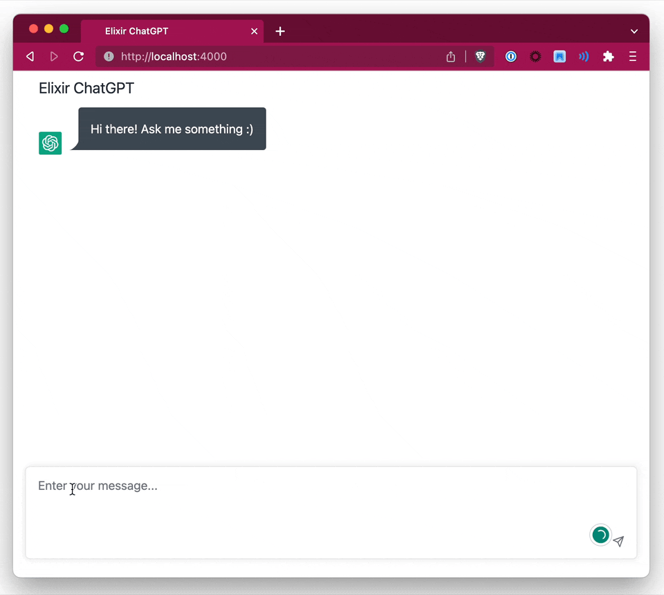

# Selfhosted ChatGPT

ChatGPT to host yourself, written in Elixir + LiveView



## What is this?

The goal is to create a simple ChatGPT UI that uses the OpenAI APIs directly, for you and your company to self-host.

### Why?

According to the [OpenAI API Usage Policy](https://openai.com/policies/api-data-usage-policies), data from ChatGPT usage will be used to train their models. Usage of the API however, will not.

Some companies want to offer ChatGPT internally to their employees, but without having company data end up in the training set.

## Features

- Use your own OpenAI API key
- Google OAuth authentication
- Restrict access to certain email domains
- Set which model to use
- Code highlighting with [highlightjs](https://highlightjs.org/)

## Configuration

In config.exs, you can set the following keys:

```elixir
config :chatgpt,
  title: "Elixir ChatGPT",
  model: "gpt-4", # or gpt-3.5-turbo
  enable_google_oauth: true,
  restrict_email_domains: false,
  allowed_email_domains: ["google.com"]
```

Then in `runtime.exs`:

```elixir

# generate them at https://platform.openai.com/account/api-keys
config :ex_openai,
  api_key: System.get_env("OPENAI_API_KEY"),
  organization_key: System.get_env("OPENAI_ORGANIZATION_KEY"),
  http_options: [recv_timeout: 50_000]

# If you set `enable_google_oauth`, also set the following keys: (by default, uses the environment variables)
# check https://github.com/dwyl/elixir-auth-google/blob/main/create-google-app-guide.md on how to get these keys

config :elixir_auth_google,
  client_id: System.get_env("GOOGLE_AUTH_CLIENT_ID"),
  client_secret: System.get_env("GOOGLE_AUTH_CLIENT_SECRET")
```

## Usage

Run with `mix phx.server`

## Usage / Deploying with Docker

First of all, generate a new random keybase: `mix phx.gen.secret`. A default is set, but you should *really* change this before deploying.

```
docker build . -t chatgpt
docker run -e SECRET_KEY_BASE=<keybase here> -e HOST="localhost" -p 4000:4000 chatgpt
```

The container (by default) expects the following env vars (unless you changed it in `runtime.exs`):

- HOST
- PORT (default 4000)
- SECRET_KEY_BASE
- OPENAI_API_KEY
- OPENAI_ORGANIZATION_KEY
- GOOGLE_AUTH_CLIENT_ID
- GOOGLE_AUTH_CLIENT_SECRET

## Status

Super work-in-progress
