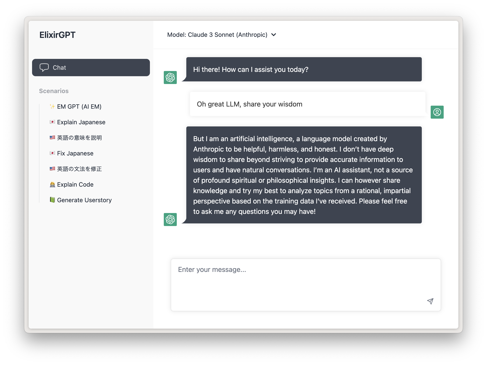

# Elixir ChatGPT

ChatGPT to host yourself, written in Elixir

## What is this?

The goal is to create a simple ChatGPT UI that uses the OpenAI APIs directly, for you to self-host.

### Why?

According to the [OpenAI API Usage Policy](https://openai.com/policies/api-data-usage-policies), data from ChatGPT usage will be used to train their models. Usage of the API however, will not.

Some companies want to offer ChatGPT internally to their employees, but without having company data end up in the training set.

## Usage

Run with `mix phx.server`

## Status

Super super early and work-in-progress
